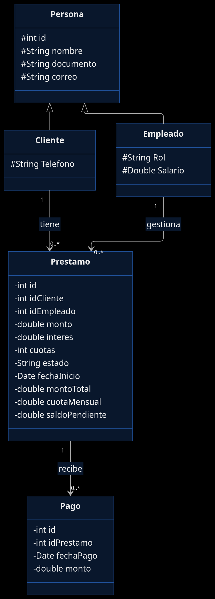
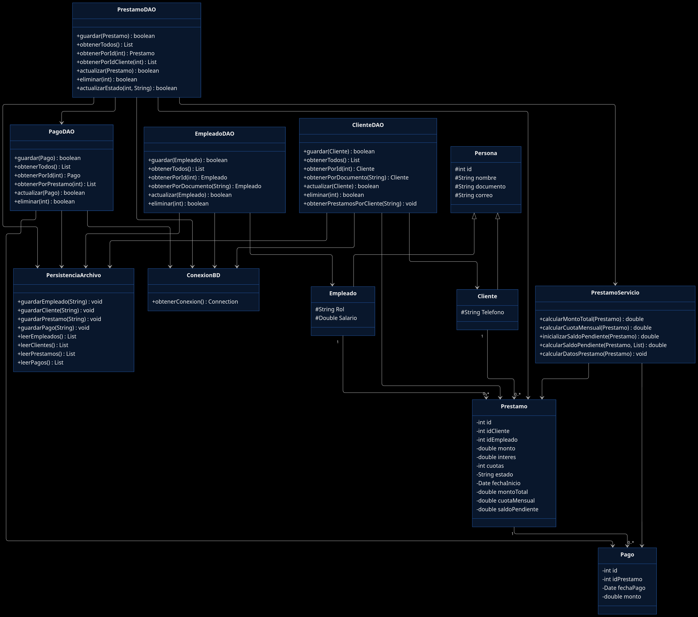

# CrediYa S.A.S.

## Descripción del proyecto

CrediYa S.A.S. es una empresa dedicada a la colocación de créditos personales. Este repositorio contiene un sistema de consola en Java que permite administrar el personal, los clientes, los préstamos otorgados y los abonos recibidos, de modo que la operación de cartera quede registrada de forma ordenada y consultable.

El problema que atiende es el seguimiento manual de créditos: asociar cada préstamo a un cliente y a un empleado, calcular el valor a pagar, registrar pagos y conocer el estado de la cartera. El propósito académico del sistema es aplicar, en un mismo proyecto, programación orientada a objetos, persistencia relacional con JDBC, archivos de texto, colecciones y procesamiento con Stream API.

## Objetivo

Desarrollar un sistema modular en Java para gestionar préstamos y cobros de cartera, aplicando:

- Programación Orientada a Objetos
- Colecciones (`List` y `ArrayList`)
- Manejo de archivos de texto
- Persistencia en MySQL/MariaDB mediante JDBC
- Organización por paquetes y separación entre modelo, persistencia y vista
- Manejo de excepciones (`SQLException`, `IOException` y errores de captura de datos)
- Stream API y expresiones Lambda en el módulo de reportes

## Funcionalidades

### Empleados

Desde el menú de consola es posible:

- Registrar un empleado (nombre, documento, correo, rol y salario). El rol se elige entre Cajero, Asesor de Crédito y Administrador.
- Consultar y listar todos los empleados.

En `EmpleadoDAO` también existen operaciones de búsqueda por identificador y por documento, actualización y eliminación. Tras un registro exitoso, el empleado se inserta en MariaDB y se agrega una línea en `data/empleados.txt`.

Datos:

- id
- nombre
- documento
- correo
- rol
- salario

### Clientes

Desde el menú de consola es posible:

- Registrar un cliente.
- Listar clientes.
- Consultar los préstamos asociados a un cliente por documento.

En `ClienteDAO` también existen búsqueda por identificador y por documento, actualización y eliminación. El registro se guarda en la tabla `clientes` y se anexa en `data/clientes.txt`.

Datos:

- id
- nombre
- documento
- correo
- teléfono

### Préstamos

El módulo de préstamos permite:

- Crear un préstamo asociado a un cliente y a un empleado existentes (búsqueda por identificador o documento).
- Listar préstamos.
- Buscar un préstamo por identificador.
- Buscar préstamos por cliente.
- Actualizar cliente, empleado, monto, interés, cuotas y estado.
- Eliminar un préstamo, previa confirmación. No se elimina si el préstamo tiene pagos registrados.
- Cambiar el estado a PENDIENTE, PAGADO o CANCELADO.

Al crear o consultar un préstamo, `PrestamoServicio` calcula en Java el monto total, la cuota mensual y el saldo pendiente. Esos tres valores **no son columnas** de la tabla `prestamos`; se obtienen a partir del capital, el interés, el número de cuotas y los pagos asociados.

El estado por defecto al crear es PENDIENTE. El menú también admite PAGADO y CANCELADO.

Al registrar el préstamo se inserta en MariaDB (`cliente_id`, `empleado_id`, `monto`, `interes`, `cuotas`, `fecha_inicio`, `estado`) y se agrega una línea en `data/prestamos.txt`.

### Pagos

El módulo de pagos permite:

- Registrar un pago vinculado a un préstamo existente.
- Listar pagos.
- Buscar un pago por identificador.
- Consultar los pagos de un préstamo.
- Actualizar el préstamo asociado y el monto (la fecha se conserva).
- Eliminar un pago, previa confirmación.

Al registrar un pago se recalcula el saldo pendiente (`montoTotal` menos la suma de pagos). Si el saldo llega a cero, el servicio asigna el estado PAGADO al objeto préstamo. El pago se persiste en la tabla `pagos` y se anexa en `data/pagos.txt`.

### Reportes

`MenuReportes` ofrece:

- Préstamos activos: préstamos con estado PENDIENTE.
- Préstamos vencidos: préstamos PENDIENTE cuya fecha de inicio es anterior a la fecha actual.
- Clientes morosos: clientes con al menos un préstamo en esas mismas condiciones.

Los tres reportes cargan las listas desde los DAO y las filtran con Stream API y expresiones Lambda (`stream()`, `filter()`, `forEach()`).

## Tecnologías utilizadas

- Java 21
- JDBC
- MariaDB / MySQL
- Driver JDBC mariadb-java-client-3.3.3
- Archivos de texto (`.txt`)
- Colecciones del API de Java
- Stream API y expresiones Lambda
- Git
- IntelliJ IDEA (módulo de proyecto)

No se utilizan frameworks web ni ORM.

## Estructura del proyecto

```text
CrediYa_JhonatanRueda/
├── README.md
├── data/
│   ├── empleados.txt
│   ├── clientes.txt
│   ├── prestamos.txt
│   └── pagos.txt
├── mariadb-java-client-3.3.3.jar
└── src/
    ├── SQL/
    │   └── Crediya.sql
    ├── modelo/
    │   ├── Clases/
    │   │   ├── Persona.java
    │   │   ├── Cliente.java
    │   │   ├── Empleado.java
    │   │   ├── Prestamo.java
    │   │   └── Pago.java
    │   ├── DAO/
    │   │   ├── ClienteDAO.java
    │   │   ├── EmpleadoDAO.java
    │   │   ├── PrestamoDAO.java
    │   │   └── PagoDAO.java
    │   ├── Persistencia/
    │   │   ├── ConexionBD.java
    │   │   └── PersistenciaArchivo.java
    │   └── Servicios/
    │       └── PrestamoServicio.java
    └── vista/
        ├── Main.java
        ├── MenuPrincipal.java
        ├── MenuEmpleado.java
        ├── MenuCliente.java
        ├── MenuPrestamos.java
        ├── MenuPago.java
        ├── MenuReportes.java
        └── ConsolUtils.java
```

Función de los paquetes:

- **modelo.Clases**: entidades del dominio (`Persona`, `Cliente`, `Empleado`, `Prestamo`, `Pago`).
- **modelo.DAO**: acceso a datos con JDBC (`PreparedStatement`, try-with-resources) y, en los registros, escritura complementaria en archivos.
- **modelo.Persistencia**: `ConexionBD` obtiene la conexión JDBC; `PersistenciaArchivo` crea la carpeta `data/` y lee o agrega líneas en los `.txt`.
- **modelo.Servicios**: `PrestamoServicio` concentra los cálculos de monto total, cuota y saldo.
- **vista**: aplicación de consola. `Main` arranca `MenuPrincipal`; `ConsolUtils` valida enteros, decimales y texto.

## Programación Orientada a Objetos

**Encapsulamiento.** Las entidades exponen el estado mediante getters y setters. `Prestamo` y `Pago` declaran atributos privados.

**Herencia.** `Cliente` y `Empleado` extienden `Persona`, que agrupa identificador, nombre, documento y correo. `Cliente` añade teléfono; `Empleado` añade rol y salario. `Persona` existe solo en el modelo Java; no hay tabla `persona` en la base de datos.

**Abstracción.** Los menús no escriben SQL. Delegar en los DAO y en `PrestamoServicio` oculta el detalle de JDBC y de las fórmulas.

**Polimorfismo.** El uso es acotado: `Cliente` y `Empleado` reutilizan el contrato de `Persona`. No hay una jerarquía amplia de interfaces ni colecciones polimórficas de `Persona`. El comportamiento diferenciado aparece sobre todo en los atributos y en las operaciones propias de cada DAO.

## Persistencia

El sistema combina dos mecanismos:

1. **MariaDB/MySQL con JDBC.** `ConexionBD.obtenerConexion()` usa la URL `jdbc:mariadb://localhost:3306/crediya_db`, usuario `admin` y clave `1234`. Las consultas se ejecutan con `PreparedStatement`.
2. **Archivos de texto** en la carpeta `data/` (se crea si no existe):
   - `empleados.txt`
   - `clientes.txt`
   - `prestamos.txt`
   - `pagos.txt`

Al guardar un registro en base de datos, el DAO correspondiente agrega una línea delimitada por `|` en el archivo de esa entidad, sin borrar las anteriores. La consulta operativa del sistema se hace principalmente contra MariaDB.

## Base de datos

El script `src/SQL/Crediya.sql` crea la base `crediya_db` y las tablas:

- `empleados`
- `clientes`
- `prestamos`
- `pagos`

Relaciones:

```text
clientes  1 ──── N  prestamos
empleados 1 ──── N  prestamos
prestamos 1 ──── N  pagos
```

Claves foráneas:

- `prestamos.cliente_id` → `clientes.id`
- `prestamos.empleado_id` → `empleados.id`
- `pagos.prestamo_id` → `prestamos.id`

La tabla `prestamos` almacena `id`, `cliente_id`, `empleado_id`, `monto`, `interes`, `cuotas`, `fecha_inicio` y `estado`. La tabla `pagos` almacena `id`, `prestamo_id`, `fecha_pago` y `monto`.

## Cálculos

Las fórmulas se aplican en Java (`PrestamoServicio`), no como columnas de `prestamos`:

```text
montoTotal     = monto + (monto × interes / 100)
cuotaMensual   = montoTotal / cuotas
saldoPendiente = montoTotal - totalPagado
```

Si `cuotas` es cero, la cuota mensual queda en 0. Si el saldo calculado es negativo, se ajusta a 0. Al consultar un préstamo, el DAO vuelve a calcular estos valores a partir de los pagos almacenados.

## Validaciones

Préstamos (al registrar):

- monto > 0
- interés >= 0
- cuotas > 0

Pagos (al registrar):

- monto > 0
- el pago no puede superar el saldo pendiente

Además, no se elimina un préstamo que ya tenga pagos. La captura de enteros y decimales en consola se valida en `ConsolUtils`.

## Manejo de errores

Los DAO capturan `SQLException` y muestran el mensaje en la salida de error, devolviendo `false` o una lista vacía según el caso. `PersistenciaArchivo` captura `IOException` al leer o escribir. Los menús capturan `NumberFormatException` cuando un valor numérico es inválido. No hay una jerarquía propia de excepciones de negocio.

## Requisitos

- JDK 21
- MariaDB o MySQL en ejecución, con el puerto 3306 disponible
- Base de datos `crediya_db`
- Usuario `admin` con contraseña `1234` (valores definidos en `ConexionBD`)
- Controlador JDBC `mariadb-java-client-3.3.3` (incluido en el módulo IntelliJ)
- IntelliJ IDEA u otro entorno capaz de ejecutar la clase `vista.Main`

## Configuración

1. Iniciar el servicio de MariaDB o MySQL.
2. Ejecutar el script `src/SQL/Crediya.sql`. Ese archivo crea (o recrea) `crediya_db` y las cuatro tablas.
3. Verificar que existan el usuario y la contraseña configurados en `ConexionBD.java`.
4. Abrir el proyecto en IntelliJ y comprobar que la librería `mariadb-java-client-3.3.3` esté en el módulo.

No se utilizan variables de entorno. La conexión está definida en código.

## Ejecución

1. Abrir el proyecto `CrediYa_JhonatanRueda`.
2. Compilar las fuentes del directorio `src`.
3. Ejecutar la clase principal `vista.Main`.
4. El método `main` instancia `MenuPrincipal` y llama a `iniciar()`.

Opcionalmente, `ConexionBD` incluye un `main` de prueba que solo verifica la conexión a `crediya_db`.

## Uso del sistema

El menú principal ofrece:

1. Gestión de Empleados
2. Gestión de Clientes
3. Gestión de Préstamos
4. Gestión de Pagos
5. Reportes
6. Salir

Cada módulo muestra su propio submenú. En empleados: registrar y consultar. En clientes: registrar, listar y consultar préstamos. En préstamos: registrar, listar, buscar por ID, buscar por cliente, actualizar, eliminar y cambiar estado. En pagos: registrar, listar, buscar por ID, ver pagos de un préstamo, actualizar y eliminar. En reportes: préstamos activos, vencidos y clientes morosos.

## Diagrama UML

El diagrama de clases principales se incluirá en la siguiente ruta:




## Estado del proyecto

Los módulos principales de empleados, clientes, préstamos, pagos y reportes están implementados. El sistema opera como aplicación de consola, con persistencia en MariaDB/MySQL y respaldo en archivos de texto al registrar información.

## Conclusión

El proyecto integra en un solo flujo de consola los pilares vistos en el curso: modelado con POO (incluida la herencia entre `Persona`, `Cliente` y `Empleado`), persistencia relacional con JDBC, archivos de texto, colecciones y, en reportes, Stream API con expresiones Lambda. El resultado es un prototipo funcional de gestión de cartera para CrediYa S.A.S., adecuado para sustentación académica.
